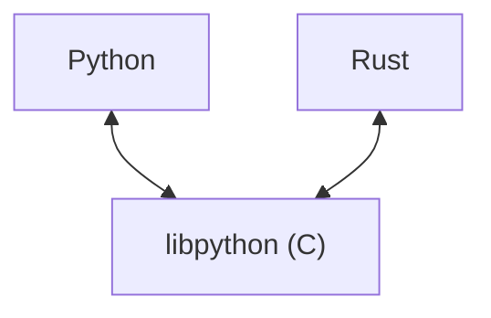

# Faster Python with Friends

Stronger with friends 💪


---
layout: presenter
photo: /images/pic-blur.png
hideInToc: true
---

# About me

- ✉️ murilo@dataroots.io
- 🇧🇷 → 🇧🇪: Brazilian @ Belgium
- 🤓 B.Sc. in Mechanical Engineering @PNW
- 👨‍🎓 M.Sc. in Artificial Intelligence @KUL
- ☁️ GCP - (Data &) ML Engineer
- ☁️ AWS Certified - Machine Learning
- ☁️ Hashicorp Certified - Terraform
- ☁️ Astronomer Certified - DAG Authoring & Airflow
- ☁️ Snowflake - SnowPro Core
- 🙋‍♂️ Coach & tech lead @ AI Unit
- 🤖 MLE @ dataroots

<style>
li:not(li:first-child) {
  margin-top: 0;
}
</style>


---
hideInToc: true
layout: twocols
---

# Today

::left::

<Toc/>

::right::

<br/>
<br/>


<style>
li:not(li:first-child) {
  margin-top: 0;
}
</style>


---
layout: twocols
---

# Is Python slow?
::left::

<br/>
<br/>

<v-click>


</v-click>

::right::


---
layout: twocols
---

# Experiment

> <span class="animate-flash">🚨</span> Benchmarks are always wrong <span class="animate-flash">🚨</span>

<br/>

::left::

<v-clicks>

1. Fibonacci
2. Triangles in network

</v-clicks>

<v-click at=4>
```bash
faster-python-with-friends/
├── ...
├── data/
├── presentation/
├── scripts
│   ├── time_fib.py
│   ├── time_np.py
│   └── time_tri.py
└── src
    ├── cy/
    ├── py/
    └── rs/
```
</v-click>

::right::

<br/>

<v-click at=2>

$$f(n) = f(n-1) + f(n-2)$$

</v-click>

<v-click at=3>


</v-click>


---
hideInToc: true
---

# Python 3.10 (baseline)

## <carbon-arrow-right />  fibonacci

<RenderWhen context="main"><Asciinema src="casts/fibonacci/py310.cast" :playerProps="{speed: 2, idleTimeLimit: 2, fit: false }" class="scale-90"></Asciinema></RenderWhen>


---
hideInToc: true
---

# Python 3.10 (baseline)

## <carbon-arrow-right />  triangles

<RenderWhen context="main"><Asciinema src="casts/triangles/py310.cast" :playerProps="{speed: 2, idleTimeLimit: 2, fit: false }" class="scale-90"></Asciinema></RenderWhen>


---
hideInToc: true
---

# Faster?

::right::

<div v-click="1">

<Tweet id="1677648534563086338" scale=0.8 />

</div>

::left::

<v-click at=2>

## Do we care?

</v-click>

<v-clicks at=3>

- Yes!
- Not everything "needs" to be fast, but it's always  nicer to
- Overall trend in Python
	- [Faster CPython](https://devblogs.microsoft.com/python/python-311-faster-cpython-team/) (3.11)
  	- No-GIL Python (tentatively 3.13)

</v-clicks>

<br/>

<div v-click="2">

</div>

<style>
li:not(li:first-child) {
  margin-top: 0;
}
</style>


---
hideInToc: true
---

# Python 3.11

## <carbon-arrow-right />  fibonacci (baseline: 31.9s)

<RenderWhen context="main"><Asciinema src="casts/fibonacci/py311.cast" :playerProps="{speed: 2, idleTimeLimit: 2, fit: false }" class="scale-90"></Asciinema></RenderWhen>

---
hideInToc: true
---

# Python 3.11

## <carbon-arrow-right />  triangles (baseline: 133.9s)

<RenderWhen context="main"><Asciinema src="casts/triangles/py311.cast" :playerProps="{speed: 2, idleTimeLimit: 2, fit: false }" class="scale-90"></Asciinema></RenderWhen>

---

# Python 3.11
## Why not always faster?

<br/>

<RenderWhen context="main"><Asciinema src="casts/py311.cast" :playerProps="{speed: 2, idleTimeLimit: 2, fit: false }"></Asciinema></RenderWhen>


---
layout: twocols
---

# Cython

::left::

<v-clicks>

- [Cython 3.0 recently released!](https://github.com/cython/cython/milestone/58) 🎉
- Transpile Python to C extensions (that can be used in Python again)
- Aims to be a Superset of Python
	- `cdef`, `cimport`, ...
- Also possible to [augment `.py` with Cython types](https://cython.readthedocs.io/en/latest/src/tutorial/pure.html?highlight=526#augmenting-pxd)
- Allows [bypassing the GIL](https://cython.readthedocs.io/en/latest/src/tutorial/pure.html?highlight=526#managing-the-global-interpreter-lock)
- Has [limitations](https://cython.readthedocs.io/en/latest/src/userguide/limitations.html#cython-limitations)

</v-clicks>

::right::

<iframe src="https://cython.readthedocs.io/en/latest/src/quickstart/cythonize.html#faster-code-via-static-typing" class="h-sm w-sm rounded shadow"/>


---
layout: twocols
hideInToc: true
---

# Cython
## Typing

::left::

<v-click>

`src/py/fibonacci.py`
<br/><br/>

```python
def fib(n: int) -> int:
    """Calculate the nth Fibonacci number."""
    if n <= 1:
        return n
    return fib(n - 2) + fib(n - 1)
```
</v-click>

::right::

<v-click>

`src/cy/fibonacci.py`
```python {|1,4|}
import cython


def fib(n: cython.int) -> cython.int:
    """Calculate the nth Fibonacci number."""
    if n <= 1:
        return n
    return fib(n - 2) + fib(n - 1)
```
</v-click>

<!--
- show typing differences
- show snippet of project sstructure after cythonize
  - mention that if .so is available, it will be used

- demo:
  - cy without cythonize is the same as python performance
  - cythonize py + run py
  - cythonize cy + run cy
- could not run with cython outside type hintts
-->

---
hideInToc: true
---

# Cython

## <carbon-arrow-right />  fibonacci (baseline: 31.9s)

<RenderWhen context="main"><Asciinema src="casts/fibonacci/cy.cast" :playerProps="{speed: 2, idleTimeLimit: 2, fit: false }" class="scale-85"></Asciinema></RenderWhen>


---
hideInToc: true
---

# Cython

## <carbon-arrow-right />  triangles (baseline: 133.9s)

<RenderWhen context="main"><Asciinema src="casts/triangles/cy.cast" :playerProps="{speed: 2.5, idleTimeLimit: 2, fit: false }" class="scale-85"></Asciinema></RenderWhen>


---

# Mypyc

<iframe src="https://mypyc.readthedocs.io/en/latest/introduction.html#differences-from-cython"  class="w-full h-sm rounded shadow"/>


---
hideInToc: true
---

# Mypyc

## <carbon-arrow-right />  fibonacci (baseline: 31.9s / cython: 6.8s)

<RenderWhen context="main"><Asciinema src="casts/fibonacci/mypy.cast" :playerProps="{speed: 2, idleTimeLimit: 2, fit: false }" class="scale-85"></Asciinema></RenderWhen>


---
hideInToc: true
---

# Mypyc

## <carbon-arrow-right />  triangles (baseline: 133.9s / cython: 127.8s)

<RenderWhen context="main"><Asciinema src="casts/triangles/mypy.cast" :playerProps="{speed: 2.5, idleTimeLimit: 2.5, fit: false }" class="scale-85"></Asciinema></RenderWhen>


---

# Pypy

::left::

<v-clicks>

- CPython drop in (almost)
- Written in RPython
- JIT compilation, optimizing "critical" code
- Pros
	- (Much) faster
    - Little to no overhead
- Cons
	- Probably not worth it for short scripts
    - Lags behing CPython versions
    - [Doesn't play nice with C extensions](https://stackoverflow.com/questions/67927205/why-is-pypy3-slower-than-python)
    	> [At the moment of writing (October 2017) the main drawback of numpy is that cpyext is infamously slow, and thus it has worse performance compared to numpypy](https://doc.pypy.org/en/latest/faq.html#should-i-install-numpy-or-numpypy)

</v-clicks>

::right::

<br/>
<br/>


<style>
li:not(li:first-child) {
  margin-top: 0;
}
</style>

---
hideInToc: true
---

# Pypy

```python
def np_mean() -> None:
    """Time 5x numpy mean operation."""
    for _ in range(5):
        vv = np.random.rand(10_000_000).astype(np.float32)
        _ = np.mean(vv)
```

<RenderWhen context="main"><Asciinema src="casts/numpy.cast" :playerProps="{speed: 2.5, idleTimeLimit: 2.5 }" class="scale-85"></Asciinema></RenderWhen>

<!--
# Pypy

- Drop in replacement interpreter
- Written in RPython
- JIT compilation (Python is AOC)
	- Only compiles most used parts of code (compilation has a cost)
- nice if you have loops, etc. need to iterated bit by bit
not worth it if you have tasks that are very fast (ie.: <1s) - really fast it'll take longer actually
pypy -> compiles+optimizees bytecode (takes some time as well)
lags a bit behind (python versions and whatnot)

- if a Python function works with only one or two different object types, PyPy generates machine code to handle those specific cases.

- https://stackoverflow.com/questions/67927205/why-is-pypy3-slower-than-python
- https://www.pypy.org/posts/2017/10/pypy-v59-released-now-supports-pandas-2261195727261691228.html

https://doc.pypy.org/en/latest/faq.html#should-i-install-numpy-or-numpypy
> At the moment of writing (October 2017) the main drawback of numpy is that cpyext is infamously slow, and thus it has worse performance compared to numpypy

https://morepypy.blogspot.com/2018/09/inside-cpyext-why-emulating-cpython-c.html

> However, the performance of cpyext is generally poor. A Python program which makes heavy use of cpyext extensions is likely to be slower on PyPy than on CPython.

<iframe src="https://www.pypy.org/performance.html#insider-s-point-of-view" class="h-full w-full rounded "/>

```bash
Building wheels for collected packages: numpy, py
  Building wheel for numpy (pyproject.toml) ... -
```
-->

---
hideInToc: true
---

# Pypy

## <carbon-arrow-right />  fibonacci (baseline: 31.9s)

<RenderWhen context="main"><Asciinema src="casts/fibonacci/pypy.cast" :playerProps="{speed: 2, idleTimeLimit: 2, fit: false }" class="scale-85"></Asciinema></RenderWhen>


---
hideInToc: true
---

# Pypy

## <carbon-arrow-right />  triangles (baseline: 133.9s)

<RenderWhen context="main"><Asciinema src="casts/triangles/pypy.cast" :playerProps="{speed: 2.5, idleTimeLimit: 2.5, fit: false }" class="scale-85"></Asciinema></RenderWhen>


---
layout: twocols
---

# Bindings (PyO3)

::left::

- Binding $\approx$ integrate different languages
-  <carbon-arrows-horizontal /> 
	- 
    - 
-  <carbon-arrows-horizontal /> 
	- 
    -  Pydantic

::right::

<div p-24>



</div>

<style>
 .slidev-layout li {
    line-height: 2.6em;
}
</style>

<!--
https://www.reddit.com/r/rust/comments/lrt7i8/can_someone_help_me_understand_pyo3_im_not_sure/
-->

---
hideInToc: true
---

# Bindings (PyO3)

## <carbon-arrow-right />  fibonacci (baseline: 31.9s)

<RenderWhen context="main"><Asciinema src="casts/fibonacci/rs.cast" :playerProps="{speed: 2, idleTimeLimit: 2, fit: false }" class="scale-85"></Asciinema></RenderWhen>


---
hideInToc: true
---

# Bindings (PyO3)

## <carbon-arrow-right />  triangles (baseline: 133.9s)

<RenderWhen context="main"><Asciinema src="casts/triangles/rs.cast" :playerProps="{speed: 2.5, idleTimeLimit: 2.5, fit: false }" class="scale-85"></Asciinema></RenderWhen>


---
layout: twocols
---

# Mojo

::left::

- A separate programming language 🔥
	- Statically typed
    - **Currently**, a language with Pythonic syntax
    - Not a drop-in replacement (yet)
- Aims to be superset of Python <mdi-circle-double/>
	- High and low level syntax
    - "AI features"
- [Very early stages](https://docs.modular.com/mojo/roadmap.html#sharp-edges)
	- No `kwargs`, f-strings, [comprehensions](https://docs.modular.com/mojo/roadmap.html#no-list-or-dict-comprehensions), etc.
    - <carbon-arrow-right /> a language with Pythonic syntax
- [Integrates with Python](https://docs.modular.com/mojo/programming-manual.html#python-integration)


```bash
error: cannot implicitly convert 'String' value to 'StringLiteral' in assignment`
```

```bash
high.mojo:24:12: error: cannot implicitly convert 'PythonObject' value to 'object' in return value
    return nodes
```

::right::

<div p-14>


</div>

<style>
li:not(li:first-child) {
  margin-top: 0;
}
</style>


---
hideInToc: true
---

# Recap

| method      | time - fib | time - △ | relative - fib | relative - △ | relative - mean |
| ----------- | ---------------- | ---------------- | -------------------- | -------------------- | ------------------ |
| python 3.10 | 31.8979s         | 133.9575s        | 1                    | 1                    | 1                  |
| python 3.11 | 19.1536s         | 123.0167s        | 0.6005s              | 0.9183s              | 0.7594s            |
| pypy3       | 5.9190s          | 5.9954s          | 0.1856s              | 0.0448s              | 0.1152s            |
| cython      | 6.8486s          | 127.8094s        | 0.2147s              | 0.9541s              | 0.5844s            |
| mypyc       | 1.6822s          | 117.1570s        | 0.0527s              | 0.8746s              | 0.4637s            |
| pyo3        | 0.7056s          | 3.3887s          | **0.0221s**          | **0.0253s**          | **0.0237s**        |
| mojo*       | ???              | ???              |                      |                      |                    |

\* mojo baseline was slightly different


---

# Final thoughts

- Python for most stuff, optimize for worst
- This is already the reality - add examples
- We are stronger with friends


---
layout: qrcode
url: https://github.com/murilo-cunha/faster-python-with-friends
hideInToc: true
---

# Code and slides

<br/>
